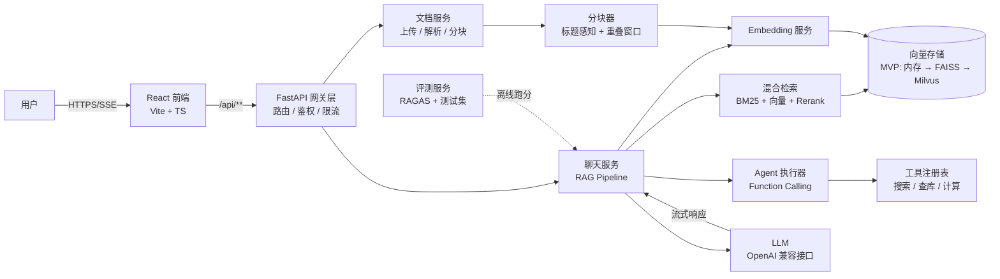
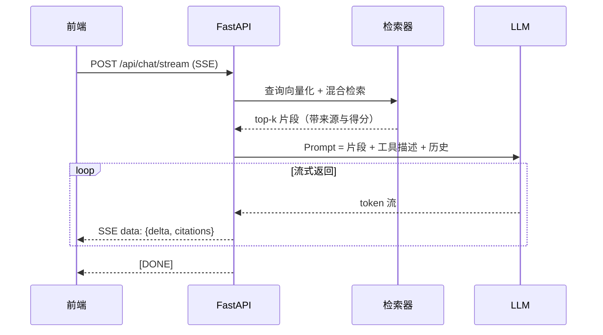

# 架构设计

## 1. 整体架构



## 2. 核心模块职责

| 模块 | 职责 | 关键设计点 |
|---|---|---|
| `app/api/routes/documents.py` | 文档上传 / 列表 / 删除 | 上传 → 解析（txt/md/pdf）→ 分块 → 嵌入 → 入库，全程异步 |
| `app/rag/chunker.py` | 文档分块 | 标题感知分段 + 固定窗口重叠，中文按段落粒度优先 |
| `app/rag/embedder.py` | 文本向量化 | OpenAI 兼容 `/embeddings`；`embedder_hash.py` 提供离线哈希实现（可插拔） |
| `app/rag/retriever.py` | 混合检索 | BM25（关键词）+ 向量（语义）加权融合 → Rerank 精排 |
| `app/rag/reranker.py` | 精排 | Null（不重排）/ Overlap（轻量重叠）；预留 bge-reranker 接入点 |
| `app/storage/vector_store.py` | 向量存储抽象 | **接口先行**：MVP 用内存实现，后续换 FAISS/pgvector/Milvus 不改业务代码 |
| `app/rag/pipeline.py` | RAG 主流程 | 查询 → 检索 → 组装 Prompt → 流式生成 → 引用溯源；Agent 启用时走工具闭环 |
| `app/agent/tools.py` | 工具注册 | 统一 `(name, description, schema, handler)`，支持同步/异步 handler |
| `app/agent/executor.py` | Agent 循环 | 流式聚合分片 tool_call → 执行工具 → 回填 role=tool → 续答；max_turns 防死循环 |
| `app/eval/` | 离线评测 | 三档检索配置命中率对比 + 自建测试集（RAGAS 生成质量指标后续接入） |

## 3. 关键演进路线（面试时可讲的故事）

```
MVP（内存向量 + 简单分块）
  └─ 为什么换 FAISS？  数据量增长后全量余弦扫描变慢，需要 ANN 索引
      └─ 为什么换 pgvector/Milvus？  需要持久化、多租户隔离、横向扩展
          └─ 加 Redis 缓存：热点问题命中缓存，P95 延迟下降、成本下降
              └─ 加可观测性：链路追踪（OpenTelemetry）+ 指标面板，量化每次查询成本
```

每一个演进点都是面试官爱问的"**你为什么这么设计 / 遇到过什么问题 / 怎么验证的**"。

## 4. 请求时序（聊天流式）



## 5. 质量与工程化

- **测试**：pytest 覆盖分块边界、向量检索正确性、接口冒烟
- **CI**：GitHub Actions（lint + test + build）
- **可观测性**：结构化日志 + 请求耗时/成本埋点
- **限流**：按 IP 的令牌桶（防止 Key 被刷爆）
- **安全**：.env 管密钥、上传文件白名单校验、CORS 白名单
